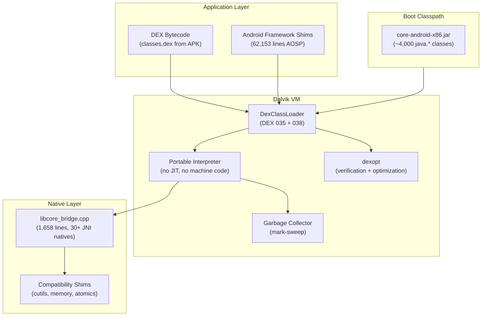

# Dalvik Universal: A Portable Dalvik VM for Modern Platforms

[]()
[]()
[]()
[]()

A standalone port of the KitKat-era Dalvik VM that runs DEX bytecode on x86_64 Linux and OpenHarmony ARM32/aarch64 -- without Android. Originally designed to execute unmodified Android APKs on non-Android operating systems.

```
 ┌───────────────────────────────────────────────────────┐
 │  Android APK (.dex bytecode)                          │
 │  ┌─────────────────────────────────────────────────┐  │
 │  │  Dalvik VM (portable interpreter, no JIT)       │  │
 │  │  ┌───────────────────────────────────────────┐  │  │
 │  │  │  libcore_bridge.cpp (30+ JNI natives)     │  │  │
 │  │  │  Math, ICU, Regex, I/O, System            │  │  │
 │  │  └───────────────────────────────────────────┘  │  │
 │  │  ┌───────────────────────────────────────────┐  │  │
 │  │  │  Boot classpath: 4,000+ java.* classes    │  │  │
 │  │  └───────────────────────────────────────────┘  │  │
 │  └─────────────────────────────────────────────────┘  │
 │          ↕ JNI                                        │
 │  Host OS (Linux x86_64 / OpenHarmony ARM32/aarch64)   │
 └───────────────────────────────────────────────────────┘
```

---

## Why This Exists

Google never made Dalvik work on 64-bit -- they replaced it with ART. But Dalvik's portable interpreter is simpler, smaller, and easier to embed than ART. For the [Westlake project](https://github.com/A2OH/westlake) (running Android APKs on OpenHarmony), we needed a lightweight VM that could be statically linked into any OS.

This port makes Dalvik run on any POSIX-like system with a C compiler. No Android kernel, no bionic libc, no system_server required.

---

## Supported Platforms

| Platform | Architecture | Status | Binary | Notes |
|----------|-------------|--------|--------|-------|
| Linux | x86_64 | **Working** | `build/dalvikvm` | Native, full test suite |
| OpenHarmony | ARM32 | **Working** | `build-ohos-arm32/dalvikvm` | Static binary, tested via QEMU |
| OpenHarmony | aarch64 | **Working** | `build-ohos-aarch64/dalvikvm` | Static binary, tested via QEMU |
| Ubuntu | ARM64 | Planned | -- | Future target |
| Linux | RISC-V | Planned | -- | Future target |

---

## Quick Start

### Build (x86_64 Linux)

```bash
git clone https://github.com/A2OH/dalvik-universal.git
cd dalvik-universal

# Build Dalvik VM + dexopt
make -j$(nproc)

# Set up runtime directories
export ANDROID_DATA=/tmp/android-data ANDROID_ROOT=/tmp/android-root
mkdir -p $ANDROID_DATA/dalvik-cache $ANDROID_ROOT/bin

# Run Hello World
./build/dalvikvm -Xverify:none -Xdexopt:none \
  -Xbootclasspath:$(pwd)/core-android-x86.jar \
  -classpath hello.dex Hello
```

### Cross-Compile (OpenHarmony ARM32)

```bash
# Requires OHOS sysroot at dalvik-port/ohos-sysroot-arm32/
./build-ohos.sh

# Test via QEMU user-mode emulation
/tmp/qemu-arm-static ./build-ohos-arm32/dalvikvm \
  -Xverify:none -Xdexopt:none \
  -Xbootclasspath:$(pwd)/core-android-x86.jar \
  -classpath hello-android.dex com.example.hello.MainActivity
```

---

## Architecture



---

## 64-Bit Port Details

Android's Dalvik assumed 32-bit pointers everywhere. Making it work on 64-bit required 46+ targeted fixes across the VM core:

### The Core Fix: `dreg_t`

The fundamental problem: Dalvik stored object references in `u4` (32-bit unsigned) register slots. On 64-bit, pointers are 8 bytes and get truncated.

**Solution:** Introduced `dreg_t` (`= uintptr_t` on 64-bit, `= u4` on 32-bit) as the register type. Every register access, JNI callback, and object reference path was updated.

### Categories of Fixes

| Category | Count | Examples |
|----------|-------|---------|
| Register width (`u4` to `dreg_t`) | 12 | Interpreter registers, method args, return values |
| JNI function pointers | 8 | JNI call bridges, native method dispatch, `FindClass` |
| Object reference handling | 6 | `AGET_OBJECT`, `APUT_OBJECT`, `IGET_OBJECT` |
| Indirect reference table | 4 | Table sizing, slot layout, reference packing |
| Atomic operations | 4 | `AtomicCache`, monitor CAS, `HeapBitmap` |
| GC / heap | 3 | Bitmap scanning, mark stack, `dvmHeapSourceAlloc` |
| String / array internals | 3 | `String.hashCode` offsets, array CLZ, type widths |
| Misc VM internals | 6 | `RegType`, `InlineArg`, dexopt, volatile fields |

### Key Design Decisions

1. **Portable interpreter only** -- no JIT, no machine-code generation. The portable interpreter is written in C and compiles on any platform.
2. **Static binary** -- no shared library dependencies on target. The ARM32 OHOS binary is fully self-contained.
3. **Dexopt fallback** -- when native methods are missing, dexopt logs a warning instead of crashing. This allows running apps that reference unavailable system services.

---

## AOSP Framework Integration

The VM includes 62,153 lines of **unmodified** AOSP framework code, compiled and linked as part of the shim layer:

| File | Lines | Source |
|------|-------|--------|
| `android.view.View` | 30,424 | KitKat AOSP, unmodified |
| `android.widget.TextView` | 13,686 | KitKat AOSP, unmodified |
| `android.view.ViewGroup` | 9,281 | KitKat AOSP, unmodified |
| + 4 more AOSP widget files | 8,762 | AbsListView, ListView, etc. |
| **Total** | **62,153** | |

### Option B Approach

Rather than cherry-picking individual methods from AOSP, we copy entire files unchanged and stub their dependencies:

```
Option A (rejected): Extract 50 methods from View.java, rewrite for OH
Option B (used):     Copy all 30,424 lines of View.java, stub 134 deps
```

This preserves exact AOSP behavior including edge cases, measure specs, touch event dispatch ordering, and accessibility hooks. The 134 dependency stubs provide minimal interfaces for system services that the framework references but doesn't critically depend on for core operation.

---

## libcore_bridge.cpp

The native bridge (1,658 lines) provides JNI implementations for core Java library methods that would normally come from Android's bionic libc and libcore:

| Category | Methods | Examples |
|----------|---------|---------|
| Math | 8 | `sin`, `cos`, `sqrt`, `pow`, `floor`, `ceil` |
| ICU (Unicode) | 6 | `toLower`, `toUpper`, `isDigit`, `getNumericValue` |
| System | 5 | `currentTimeMillis`, `nanoTime`, `arraycopy`, `identityHashCode` |
| I/O | 4 | `open`, `read`, `write`, `close` |
| Regex | 3 | `compile`, `matches`, `find` |
| Misc | 4+ | `OsConstants`, `Posix` stubs, `Runtime` stubs |

---

## Test Results

### x86_64 Linux

| Test | Result | Details |
|------|--------|---------|
| Hello World | Pass | Basic DEX execution |
| MockDonalds | 14/14 pass | Activity lifecycle, Intent, Bundle, View tree, rendering |
| Headless test suite | 2,416 pass | Full shim layer validation |
| UI test suite | 47 pass | Layout, measure, draw pipeline |
| Real APK pipeline | 3 pass | APK unzip, manifest parse, Activity launch |

### OpenHarmony ARM32 (QEMU)

| Test | Result | Details |
|------|--------|---------|
| Hello World | Pass | `os.arch = armv7l`, clean shutdown |
| Full Activity lifecycle | Pass | create, start, resume, pause, stop, destroy |
| Manifest parsing | Pass | Binary AXML, ComponentName extraction |
| Intent routing | Pass | Explicit and implicit intents |

### OpenHarmony aarch64 (QEMU)

| Test | Result | Details |
|------|--------|---------|
| Hello World | Pass | `os.arch = aarch64`, clean shutdown |
| GC stress test | Pass | Mark-sweep, no 64-bit pointer corruption |

---

## Boot Classpath

The boot classpath (`core-android-x86.jar`) provides approximately 4,000 `java.*` classes from the KitKat-era Android core library:

- `java.lang.*` -- Object, String, Thread, ClassLoader, Math, System
- `java.util.*` -- HashMap, ArrayList, Collections, concurrent, regex
- `java.io.*` -- File, InputStream, OutputStream, Reader, Writer
- `java.net.*` -- URL, Socket, HttpURLConnection
- `java.security.*` -- MessageDigest, SecureRandom, KeyStore
- `javax.crypto.*` -- Cipher, SecretKey, Mac

---

## Known Issues

| Issue | Severity | Notes |
|-------|----------|-------|
| No JIT compiler | Low | Portable interpreter is ~10x slower than JIT, but sufficient for testing. Performance not a goal. |
| DEX 039+ not supported | Medium | ART-era DEX formats. Most APKs can be reprocessed to DEX 035/038. |
| No multithreading stress testing | Medium | Basic threading works, but no exhaustive concurrency testing. |
| Missing `java.nio` channels | Low | Some advanced NIO operations not in boot JAR. |
| dexopt warnings for missing natives | Low | By design -- fallback instead of crash. |

---

## Roadmap

| Target | Priority | Status | Notes |
|--------|----------|--------|-------|
| ARM64 Ubuntu native | High | Not started | Remove OHOS sysroot dependency |
| RISC-V Linux | Medium | Not started | Portable interpreter should "just work" |
| ART bytecode support | Low | Not planned | Would require major rewrite |
| JIT compiler | Low | Not planned | Portable interpreter sufficient for compatibility layer |
| Multi-DEX loading | High | Working | DexClassLoader handles multiple DEX files |

---

## Build Artifacts

| Artifact | Path | Size |
|----------|------|------|
| dalvikvm (x86_64) | `build/dalvikvm` | ~8 MB |
| dalvikvm (ARM32 OHOS) | `build-ohos-arm32/dalvikvm` | ~6 MB (static) |
| dalvikvm (aarch64 OHOS) | `build-ohos-aarch64/dalvikvm` | ~7 MB (static) |
| dexopt (x86_64) | `build/dexopt` | ~6 MB |
| libdvm.a | `build/libdvm.a` | ~12 MB |
| core-android-x86.jar | `core-android-x86.jar` | ~8 MB |
| core-kitkat.jar | `core-kitkat.jar` | ~2 MB (minimal, 280 classes) |
| libcore_bridge.cpp | `compat/libcore_bridge.cpp` | 1,658 lines |

---

## Contributing

Contributions are welcome, especially in these areas:

1. **New platform ports** -- ARM64 Linux, RISC-V, other POSIX systems
2. **JNI native stubs** -- expanding `libcore_bridge.cpp` for more `java.*` methods
3. **Test coverage** -- more DEX files exercising edge cases
4. **DEX format support** -- extending to DEX 039+

Before contributing a new platform port, please open an issue to discuss the approach.

---

## License

Licensed under the Apache License, Version 2.0. See [LICENSE](LICENSE) for details.

Dalvik VM was originally developed by Google as part of the Android Open Source Project (AOSP). This is an independent port for non-Android platforms.
